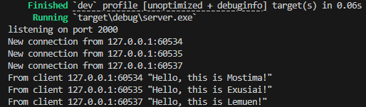
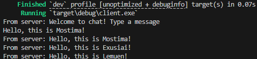
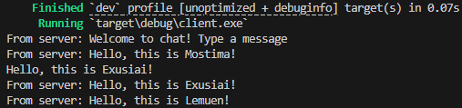
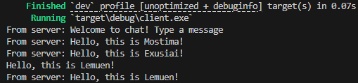
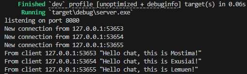
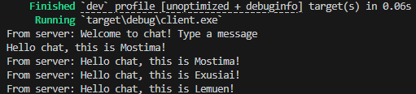
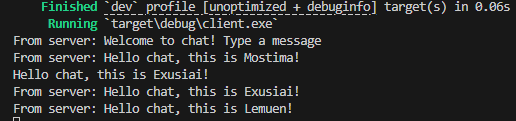
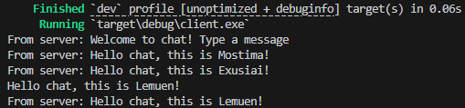
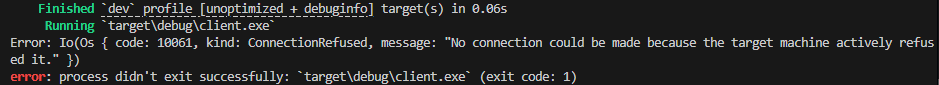

# Experiment README
## Experiment 2.1: Original code, and how it run
  
  
  
  
- From the output above, we can see that the server acts as a listener and receives connections from each client. The server receives and distributes new messages as they are sent. Each client can create messages and receive messages from other connected clients, with the server handling the processing.

## Experiment 2.2: Modifying port
  
  
  
  
- If we change both the server and client ports with the same port number, the app works fine just like the picture above.
  
- However, if we change only 1 port (either client or server), we will get an error. This is because the client can't find the target server with the corresponding port just like the picture above.